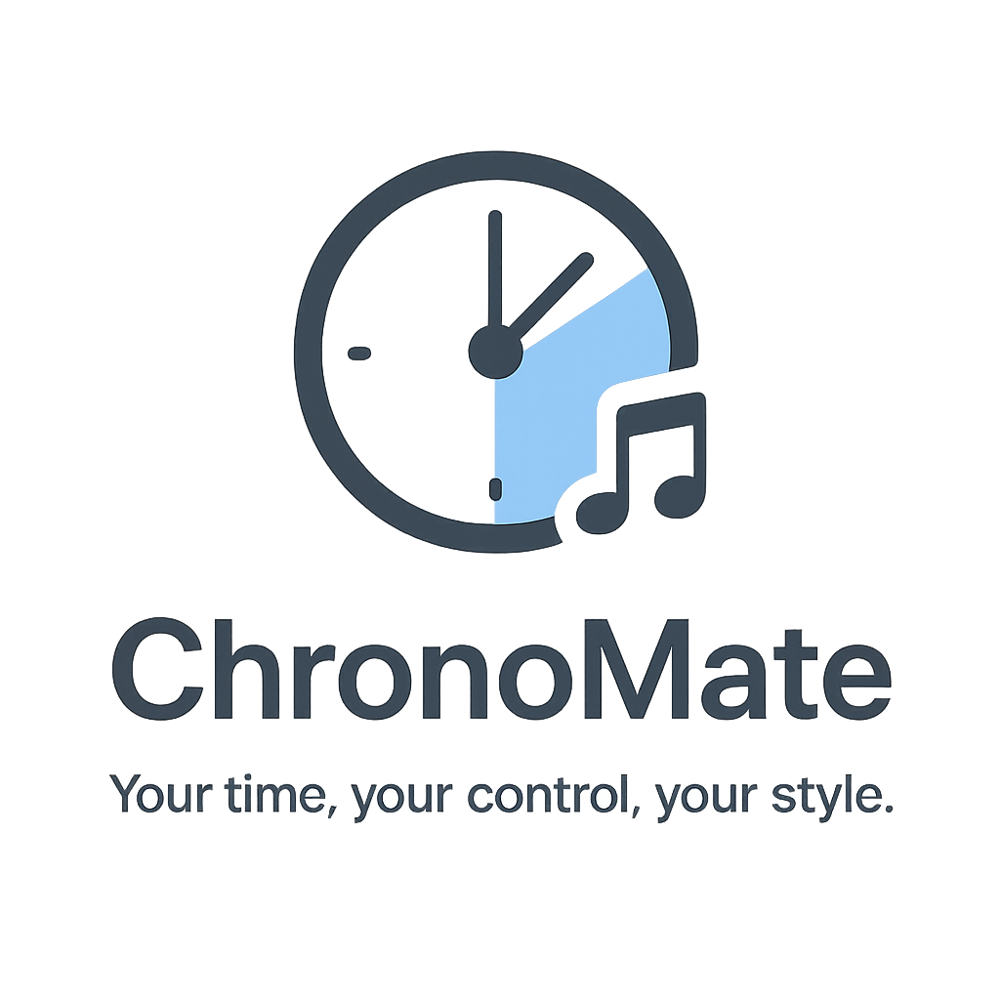

# ⏰ ChronoMate ⏰ 
  
A modern, stylish, and customizable **Countdown Timer** app built with **Python (Tkinter)**.  
Easily manage your time with **dark mode**, **custom alarm sounds**, and **desktop notifications**.  

### ✨ Features :--  

- 🕒 **Set Timer** – Enter time in **Minutes** or **Seconds**  
- 🎨 **Light / Dark Mode** – Toggle between themes for comfortable usage  
- 📊 **Progress Bar** – Visual progress indicator while timer runs  
- ⏯ **Start, Pause, Resume & Reset** – Full control over your countdown  
- 🎵 **Custom Alarm Sound** – Choose your favorite alarm sound (MP3/WAV)  
- 🔔 **Desktop Notifications** – Get notified when time is up  
- 🚨 **Built-in Buzzer** – Works even without custom sounds  

### 🚀 Installation :-- 

1. Clone this repository
2. Install dependencies
3. Run the app

### 📦 Requirements :--

- Python 3.7+
- Libraries :--
  
    -- tkinter (built-in)
  
    -- Pillow 🖼️ (for logo handling)
  
    -- plyer 🔔 (for desktop notifications)
  
    -- playsound 🎵 (for alarm sound)

### ⚡ How It Works :--

1. Enter your desired time ⏱️
2. Choose unit (Minutes / Seconds)
3. Click ▶ Start
4. Pause ⏸, Resume ▶, or Reset 🔄 anytime
5. Get notified with a sound + message when time’s up 🚨

### 🌙 Themes :--

- Light Mode ☀️ – Simple and clean
- Dark Mode 🌙 – Sleek and modern

### ⏰ Stay productive. Stay on time with ChronoMate! ⏰

🤝 Contributions are welcome!

👨‍💻 Rama Lingeswara Rao Sivakavi
